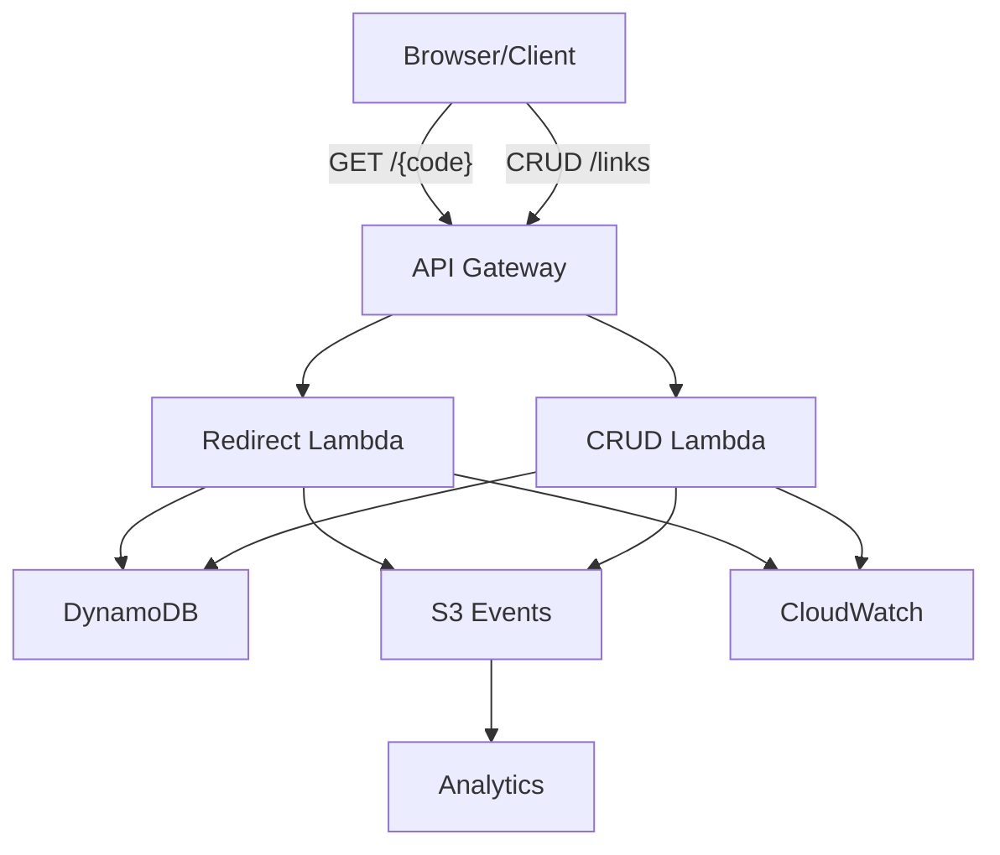

# Chainy Backend – AWS/Terraform URL Shortener Scaffold

Chainy Backend is a learning scaffold for building a serverless short URL platform on AWS with Terraform.

> 💡 Looking for the frontend application? Check out [chainy-web](https://github.com/ChuLiYu/chainy-web). It wires together an HTTP API, Lambda functions, DynamoDB storage, and a lightweight event pipeline where Lambda writes JSONL records straight to S3 so you can focus on iterating and deepening your AWS + Terraform skills.

> 🇹🇼 Looking for the Traditional Chinese guide? See [README_ZH.md](README_ZH.md).

## Architecture Diagram

- [Architecture Overview (English)](docs/architecture.md)
- [Architecture Overview (Chinese)](docs/architecture_ZH.md)



## Repository Structure

```
backend.tf              # Remote state definition (edit with your S3/DynamoDB details)
main.tf                 # Root module wiring all submodules
tfvars/                 # (optional) directory for environment-specific tfvars files
modules/
  api/                  # API Gateway HTTP API + routes + Lambda permissions
  db/                   # DynamoDB table definition for short links
  events/               # S3 bucket (with lifecycle policies) for domain events
  lambda/               # Redirect + CRUD Lambdas and IAM roles
handlers/               # TypeScript Lambda sources
lib/                    # Shared TypeScript utilities (DynamoDB client)
scripts/                # esbuild bundling script for Lambda packages
dist/                   # Generated Lambda bundles (created by `npm run package`)
README.md               # English documentation
README_ZH.md            # Traditional Chinese documentation
web/                    # Minimal static web client for generating short links
variables.tf            # Root input variables
outputs.tf              # Root outputs
package.json, tsconfig.json
```

## Prerequisites

- Terraform 1.9+
- AWS CLI configured with credentials that can provision the resources
- Node.js 20+

## Bootstrapping remote state resources (one-time)

Before working with the main Terraform stack, create the remote state bucket and lock table with the helper configuration under `bootstrap/`:

```bash
cd bootstrap
terraform init
terraform apply \
  -var="state_bucket_name=your-unique-chainy-state-bucket" \
  -var="lock_table_name=chainy-terraform-locks"
```

Copy the bucket and table names from the outputs, then update `backend.tf` (or pass `-backend-config` flags) in the root stack to reference them.

### One-time remote state setup

1. Create an S3 bucket for Terraform state (e.g. `chainy-terraform-state`).
2. Create a DynamoDB table for state locking (e.g. `chainy-terraform-locks`) with primary key `LockID` (string).
3. Update `backend.tf` with your bucket, key prefix, region, and DynamoDB table.

## Lambda packaging workflow

The Lambda module expects pre-built bundles under `dist/redirect` and `dist/create` before you run `terraform plan` or `terraform apply`. Use the included Node tooling:

```bash
npm install            # install TypeScript + esbuild + AWS SDK
npm run package        # bundles handlers into dist/redirect and dist/create
```

Re-run `npm run package` whenever you change the TypeScript source before deploying.

### Configuration variables

Create a `terraform.tfvars` (or environment-specific `dev.tfvars`) with at least:

```hcl
environment = "dev"
region      = "ap-northeast-1"

# Optional additional environment variables for Lambda
lambda_additional_environment = {}
```

- `environment` controls resource naming, tags, and outputs; `region` defaults to `ap-northeast-1` and can be adjusted as needed.
- `lambda_additional_environment` can be used to add additional environment variables; hash salts are retrieved from AWS Systems Manager Parameter Store by default at paths `/chainy/<environment>/CHAINY_HASH_SALT` and `/chainy/<environment>/CHAINY_IP_HASH_SALT`, which can be overridden via `hash_salt_parameter_name` / `ip_hash_salt_parameter_name`.
- Use `aws ssm put-parameter --type SecureString --value "$(openssl rand -hex 32)"` to create salts and ensure Lambda IAM roles have `ssm:GetParameter` permissions.

## Minimal Web Client

The `/web` directory contains a lightweight static page (HTML/CSS/JS) for creating short links without leaving the browser. To preview locally:

```bash
cd web
python -m http.server 4173
```

Open `http://localhost:4173`, fill in the API endpoint (e.g. `https://xxxx.execute-api.ap-northeast-1.amazonaws.com`) and create short links instantly. For deployment you can `aws s3 sync web/ s3://<your-web-bucket> --delete` and invalidate CloudFront, or plug the build into the CI/CD workflow.

## Deploying with Terraform

1. Copy `terraform.tfvars.example` → `terraform.tfvars` (create the example file if you prefer) and set values:
   - `environment = "dev"`
   - `region = "ap-northeast-1"` (or your preferred region)
   - Optional overrides: `redirect_build_dir`, `create_build_dir`, `extra_tags`.
2. Initialize:

   ```bash
   terraform init -backend-config="bucket=your-state-bucket" \
                  -backend-config="key=dev/chainy.tfstate" \
                  -backend-config="region=ap-northeast-1" \
                  -backend-config="dynamodb_table=your-lock-table"
   ```

3. Validate the configuration:

   ```bash
   terraform fmt      # optional formatting
   terraform validate
   ```

4. Review the plan:

   ```bash
   terraform plan -var="environment=dev"
   ```

5. Apply when ready:

   ```bash
   terraform apply -var="environment=dev"
   ```

Terraform outputs include the API endpoint, DynamoDB table name, and the events S3 bucket.

## Testing the API

After `terraform apply`, note the `api_endpoint` output (e.g. `https://abc123.execute-api.ap-northeast-1.amazonaws.com`).

1. **Create a short link**

   ```bash
   curl -X POST "$API_ENDPOINT/links" \
     -H "Content-Type: application/json" \
     -d '{"target": "https://example.com/docs", "owner": "alice"}'
   ```

   Response includes the generated `code`.

2. **Resolve a short link**

   ```bash
   curl -I "$API_ENDPOINT/yourCode"
   ```

   Expect a `301` with `Location: https://example.com/docs`.

3. **Inspect or manage a link**

   ```bash
   curl "$API_ENDPOINT/links/yourCode"
   curl -X PUT "$API_ENDPOINT/links/yourCode" \
     -H "Content-Type: application/json" \
     -d '{"target": "https://example.com/updated"}'
   curl -X DELETE "$API_ENDPOINT/links/yourCode"
   ```

## Data flow overview

1. **Link creation**: `POST /links` triggers the create Lambda, which writes metadata to DynamoDB and immediately appends a `link_create` JSONL object to the events S3 bucket.
2. **Redirect**: `GET /{code}` invokes the redirect Lambda. It looks up the target in DynamoDB, increments click counters, and asynchronously logs a `link_click` event to S3 while returning a `301` response.
3. **Lifecycle events**: Update/delete endpoints also append JSONL records so downstream analytics stay in sync.
4. **Analytics storage**: S3 objects are partitioned by event type and date/hour (e.g. `link_click/dt=2024-09-30/hour=13/...`).
5. **Insights**: Use Athena (via an external table over the JSONL keys) or import into QuickSight/ETL jobs for dashboards.

### Event privacy guardrails

- Lambda hashes `owner`, `user_agent`, and (if present) IP addresses before persisting, keeping only SHA-256 digests for grouping while hiding raw strings. Wallet signatures are never stored—only flag `wallet_signature_present`.
- Wallet addresses are masked (first 4 / last 4 characters) and referer/target URLs are normalised to origin + path; query strings and other sensitive fragments are removed.
- Optional Web3/marketing metadata such as `wallet_provider`, `wallet_type`, `chain_id`, `dapp_id`, UTM tags, geo/ASN, Accept-Language, inferred device/browser families, transaction value/currency, token symbol/address, and partner/project identifiers are retained in coarse form for analytics while the original sensitive values are either hashed, masked, or normalised.
- `tags` / `feature_flags` arrays are trimmed to at most 10 entries for cost control. A `sensitive_redacted` flag indicates events that had fields sanitised so downstream jobs can branch if needed.

### Cost snapshot

With fewer than 10k events per month, the direct-to-S3 approach keeps costs to pennies:

- **S3 PUT**: $0.005 per 1,000 requests → ≈ $0.05 for 10k events.
- **S3 storage**: JSONL events (a few KB each) stay under a few cents per month; lifecycle expires or transitions them after `click_events_retention_days` (default 30 days).
- **Lambda**: Millisecond execution time leads to <$0.01/month at the stated volume.

## 🎯 Current Deployment Status

### ✅ Successfully Deployed
- **Backend API**: `https://9qwxcajqf9.execute-api.ap-northeast-1.amazonaws.com`
- **Lambda Functions**: create, redirect (both active)
- **DynamoDB**: `chainy-dev-chainy-links` table
- **S3 Storage**: Events and web hosting buckets
- **SSM Parameters**: Secure hash salt storage
- **API Authentication**: API Key with rate limiting

### 🔄 In Progress
- **SSL Certificate**: Pending DNS validation
- **CloudFront**: Waiting for SSL certificate
- **Custom Domain**: `chainy.luichu.dev` (pending SSL)

### 🚨 Known Issues
- **Redirect Function**: Returns 404 (investigating)
- **CloudFront Output**: Not available until SSL validation

### 📚 Additional Documentation
- [Troubleshooting Guide](docs/deployment-troubleshooting.md)
- [Quick Reference](docs/quick-reference.md)

## CI/CD

- Automated checks run through `.github/workflows/ci.yml` (TODO: Add CI/CD workflow file): Node.js dependencies (`npm install`), `npm run typecheck`, `npm run test`, and Terraform `fmt` / `validate` (root + bootstrap, with backends disabled).
- To enable plan/apply from GitHub Actions, configure OIDC access for Terraform (see docs/architecture.md for recommended next steps) and supply cloud credentials via repo secrets.

## Cleaning up

When you want to tear down the scaffold, run:

```bash
terraform destroy -var="environment=dev"
```

## Future enhancements

1. **CloudFront + Custom Domain** – front the API and redirects with a custom hostname and SSL certificate managed by ACM.
2. **Cognito + OAuth** – secure CRUD APIs with Cognito-hosted auth flows or federated identity providers.
3. **QuickSight Dashboard** – visualize click analytics sourced from the S3/Athena dataset.
4. **Budgets + Alerts** – add AWS Budgets or Cost Anomaly Detection to avoid surprises.
5. **GitHub Actions CI/CD** – configure an OIDC trust to deploy Terraform plans from GitHub securely.

Happy building and good luck studying for AWS SAA + Terraform Associate!
