# Chainy - URL Shortener Service

A modern, secure, and scalable URL shortener service built with AWS serverless architecture.

[](https://chainy.luichu.dev)
[](LICENSE)
[](https://aws.amazon.com)

## 🚀 Quick Start

### Try It Now
Visit the live application: **[https://chainy.luichu.dev](https://chainy.luichu.dev)**

### Local Development
```bash
# Clone the repository
git clone https://github.com/your-username/chainy.git
cd chainy

# Start frontend development server
cd chainy-web
npm install
npm run dev
# Open http://localhost:5173

# Deploy backend (requires AWS credentials)
cd ../chainy
npm install
npm run package
terraform apply
```

## ✨ Features

- **🔐 Secure Authentication**: Google OAuth 2.0 with JWT tokens
- **🎯 Custom Short Codes**: Create memorable short URLs
- **📝 Smart Notes**: Add titles and descriptions to your links
- **📊 Analytics**: Track clicks and usage statistics
- **📌 Link Management**: Pin, organize, and delete your URLs
- **🌍 Multi-language**: English and Chinese interfaces
- **⚡ Production Ready**: Fully deployed on AWS with cost optimization

## 🏗️ Architecture

```mermaid
graph TB
    User[👤 User] --> Frontend[🌐 React Frontend]
    Frontend --> API[🚪 API Gateway]
    API --> Auth[🔐 Google OAuth]
    API --> Lambda[⚡ Lambda Functions]
    Lambda --> DB[(🗄️ DynamoDB)]
    Lambda --> S3[📦 S3 Events]
    Lambda --> CW[📊 CloudWatch]
```



**Tech Stack**:
- **Frontend**: React 18 + Vite + Tailwind CSS
- **Backend**: AWS Lambda + TypeScript
- **Database**: DynamoDB (NoSQL)
- **Authentication**: Google OAuth 2.0 + JWT
- **CDN**: CloudFront + S3
- **Security**: WAF + Rate Limiting

## 🛠️ Development Setup

### Prerequisites

- **Node.js 18+** - JavaScript runtime
- **AWS CLI** - Configured with appropriate credentials
- **Terraform 1.0+** - Infrastructure as code
- **Google Cloud Console** - For OAuth setup

### Environment Configuration

The project uses a centralized environment configuration system:

```bash
# Switch between environments
./env-switch.sh dev    # Development
./env-switch.sh prod   # Production

# Deploy specific environment
./env-switch.sh deploy dev
```

### Local Development

```bash
# Backend
cd chainy
npm install
npm run package
terraform apply

# Frontend
cd chainy-web
npm install
npm run dev
```

## 📁 Project Structure

```
chainy/                    # Backend Lambda functions
├── handlers/              # API endpoints
├── lib/                   # Shared utilities
├── modules/               # Terraform modules
└── tests/                 # E2E tests

chainy-web/                # Frontend React app
├── src/                   # React components
├── public/                # Static assets
└── dist/                  # Build output

config/                    # Environment configuration
├── environments.toml     # Environment settings
└── env-manager.sh        # Configuration management
```

## 🔧 Configuration

### Environment Variables

The system supports multiple environments with different configurations:

- **Development**: `http://localhost:3000`
- **Production**: `https://chainy.luichu.dev`

### Google OAuth Setup

1. Create a Google Cloud Console project
2. Enable Google+ API
3. Create OAuth 2.0 credentials
4. Configure authorized redirect URIs:
   - Development: `http://localhost:3000`
   - Production: `https://chainy.luichu.dev`

## 🚀 Deployment

### Production Deployment

```bash
# Deploy backend
cd chainy
terraform apply

# Deploy frontend
cd chainy-web
npm run build
aws s3 sync dist/ s3://chainy-prod-web/ --delete
aws cloudfront create-invalidation --distribution-id E1QBDOEH9EVM6M --paths "/*"
```

### Automated Deployment

Use GitHub Actions for automated deployment:

- **Backend**: `chainy/.github/workflows/deploy.yml`
- **Frontend**: `chainy-web/.github/workflows/deploy.yml`

## 🔒 Security Features

- **JWT Authentication**: Secure token-based authentication
- **CORS Protection**: Configured for specific origins
- **WAF Integration**: Web Application Firewall protection
- **Rate Limiting**: API rate limiting and throttling
- **Input Validation**: Comprehensive input sanitization

## 💰 Cost Optimization

- **Lambda Cold Start Optimization**: Connection pooling and caching
- **DynamoDB Optimization**: On-demand billing and efficient queries
- **CloudFront Caching**: Reduced origin requests
- **S3 Lifecycle Policies**: Automatic cleanup of old files

## 📊 Monitoring

- **CloudWatch Logs**: Centralized logging
- **CloudWatch Metrics**: Performance monitoring
- **Budget Alerts**: Cost monitoring and alerts
- **Error Tracking**: Comprehensive error handling

## 🧪 Testing

```bash
# Backend tests
cd chainy
npm test

# E2E tests
npm run test:e2e
```

## 📖 Usage Examples

### Web Interface
1. Visit [https://chainy.luichu.dev](https://chainy.luichu.dev)
2. Sign in with Google
3. Create short URLs with custom codes
4. Manage your links with notes and analytics

### API Usage

**Create a short URL:**
```bash
curl -X POST "https://chainy.luichu.dev/links" \
  -H "Authorization: Bearer <jwt_token>" \
  -H "Content-Type: application/json" \
  -d '{
    "target": "https://example.com",
    "code": "my-link",
    "note": "Important documentation"
  }'
```

**Response:**
```json
{
  "code": "my-link",
  "target": "https://example.com",
  "short_url": "https://chainy.luichu.dev/my-link",
  "note": "Important documentation",
  "created_at": "2025-10-03T10:00:00.000Z",
  "clicks": 0,
  "pinned": false
}
```

## 📝 API Documentation

### Authentication

All authenticated endpoints require a JWT token in the Authorization header:

```
Authorization: Bearer <jwt_token>
```

### Endpoints

- `POST /links` - Create short URL (authenticated)
- `POST /links/anonymous` - Create short URL (anonymous)
- `GET /links` - List user's short URLs (authenticated)
- `GET /links/{code}` - Get short URL details
- `PUT /links/{code}` - Update short URL (authenticated)
- `DELETE /links/{code}` - Delete short URL (authenticated)
- `GET /{code}` - Redirect to target URL

### Request/Response Examples

**Create Short URL:**

```json
POST /links
{
  "target": "https://example.com",
  "code": "custom-code",  // optional
  "note": "My important link"  // optional
}
```

**Response:**

```json
{
  "code": "custom-code",
  "target": "https://example.com",
  "short_url": "https://chainy.luichu.dev/custom-code",
  "note": "My important link",
  "created_at": "2025-10-02T03:00:00.000Z",
  "clicks": 0,
  "pinned": false
}
```

## 🤝 Contributing

1. Fork the repository
2. Create a feature branch
3. Make your changes
4. Add tests if applicable
5. Submit a pull request

## 📄 License

This project is licensed under the MIT License.

## 🆘 Support

For issues and questions:

1. Check the troubleshooting guides in `/docs`
2. Review the GitHub issues
3. Create a new issue with detailed information

## 📚 Documentation

- [DNS and CloudFront Migration](docs/DNS_CLOUDFRONT_MIGRATION.md)
- [Troubleshooting Guides](docs/troubleshooting/)
- [Security Implementation](docs/security-audit-report.md)
- [Troubleshooting Solutions](docs/TROUBLESHOOTING_SOLUTIONS.md)
- [Security Best Practices](docs/SECURITY_BEST_PRACTICES.md)
- [Deployment Guide](docs/DEPLOYMENT_GUIDE.md)

## 🔄 Recent Updates

- ✅ Added note/title feature for authenticated users
- ✅ Simplified Google login to single redirect button
- ✅ Implemented comprehensive environment configuration
- ✅ Fixed Google OAuth "Invalid OAuth code" issue
- ✅ Prepared for production deployment
- ✅ Converted all documentation to English
- ✅ Set up GitHub Actions for automated deployment
