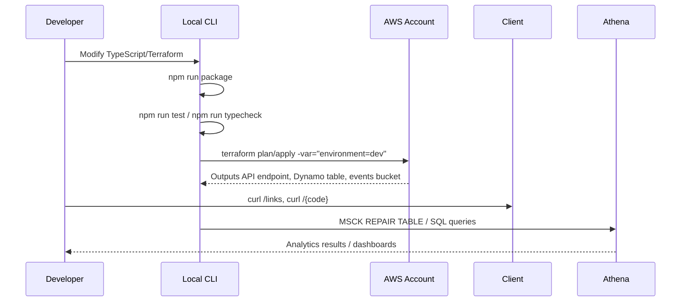

# Chainy Architecture Overview

Chainy is a serverless short URL platform designed for rapid iteration, certification prep, and data analytics experiments. This document summarises the system from the perspective of engineers, technical leads, and potential hiring partners.

## High-Level Diagram

```mermaid
flowchart LR
  subgraph Client
    User[Browser / Mobile]
  end

  subgraph AWS
    APIGW[API Gateway HTTP API]
    RedirectLambda[Lambda: redirect]
    CRUDLambda[Lambda: link CRUD]
    DynamoDB[(DynamoDB: chainy_links)]
    EventsBucket[(S3: chainy-events-<env>)]
    CloudWatch[CloudWatch Logs]
  end

  User -->|HTTP GET /{code}| APIGW
  User -->|HTTP POST/PUT/GET/DELETE /links| APIGW

  APIGW -->|Invoke| RedirectLambda
  APIGW -->|Invoke| CRUDLambda

  RedirectLambda -->|Get/Update| DynamoDB
  CRUDLambda -->|Put/Get/Update/Delete| DynamoDB

  RedirectLambda -->|Async JSONL PutObject| EventsBucket
  CRUDLambda -->|Async JSONL PutObject| EventsBucket

  RedirectLambda --> CloudWatch
  CRUDLambda --> CloudWatch

  subgraph Analytics
    Athena[Athena / Glue]
    QuickSight[QuickSight / BI]
  end

  EventsBucket --> Athena
  Athena --> QuickSight
```

## Data Collected (with Privacy Guardrails)

| Category | Example Fields | Protection | Purpose |
| --- | --- | --- | --- |
| Link metadata | `code`, `target`, `created_at`, `updated_at`, `clicks` | removes query string, timestamps stored as ISO-8601 | redirect, CRUD operations |
| Behavioural signals | `link_click`, `link_update`, `link_delete` events | event type stored as plain text | audit trail, funnels |
| Owner identifiers | `owner_hash` | SHA-256 + optional salt (irreversible) | loyalty, segmentation without storing raw owner |
| Wallet data | `wallet_address_masked`, `wallet_provider`, `wallet_type`, `wallet_signature_present`, `chain_id`, `token_symbol/address`, `transaction_value(_usd)` | partial masking, hashes | DeFi/NFT analytics, partner insights |
| HTTP context | `ip_hash`, `geo_country/region/city`, `ip_asn`, `user_language`, `device_type`, `os_family`, `browser_family` | hashed/coarse values | regional growth, anomaly detection |
| Marketing / Attribution | `utm_*`, `tags`, `feature_flags`, `integration_partner`, `project`, `developer_id` | normalised strings | ROI analysis, multi-tenant reporting |

Sensitive raw values are never persisted. Hashes use `CHAINY_HASH_SALT` / `CHAINY_IP_HASH_SALT` to prevent rainbow-table lookups. Events store `sensitive_redacted = true` when redaction occurred.

## Deployment Pipeline



## Key Components

- **API Gateway (HTTP API)**: Lightweight routing to Lambda; integrates with IAM authorizers if needed.
- **Lambda Functions**:
  - `redirect`: fetches target, increments counters, logs click events to S3.
  - `create` (CRUD handler): full CRUD, writes lifecycle events to S3.
  - TypeScript + Node.js 20, tested via `node --test` (`npm run test`).
- **DynamoDB (on-demand)**: Stores short link documents with PITR enabled.
- **S3 events bucket**: JSONL partitioned by `{event_type}/dt=YYYY-MM-DD/hour=HH`, storing sanitised analytics payloads.
- **Analytics**: Athena/Glue external tables, QuickSight dashboards or downstream ETL.
- **Observability**: CloudWatch Logs (per Lambda function).
- **Security defaults**: IAM least-privilege roles, S3 bucket SSE + public access block, hashed PII.

## Recommended Enhancements

1. **Governance**: Add data catalog + schema versioning (Glue Data Catalog, JSON Schema).
2. **Observability**: Integrate with CloudWatch Metrics/Alarm, X-Ray tracing.
3. **Automation**: GitHub Actions with OIDC, terraform plan/apply gating.
4. **Data Wrangler**: Convert JSONL to Parquet + AWS Glue ETL for cost-efficient analytics.
5. **Access Controls**: S3 access policies per environment/project, multi-tenant reporting.
6. **Product Features**: Expire links, rate limiting, token-based CRUD auth, billing integration.

Feel free to adapt the diagram (via Mermaid) or translate for non-English readers.
