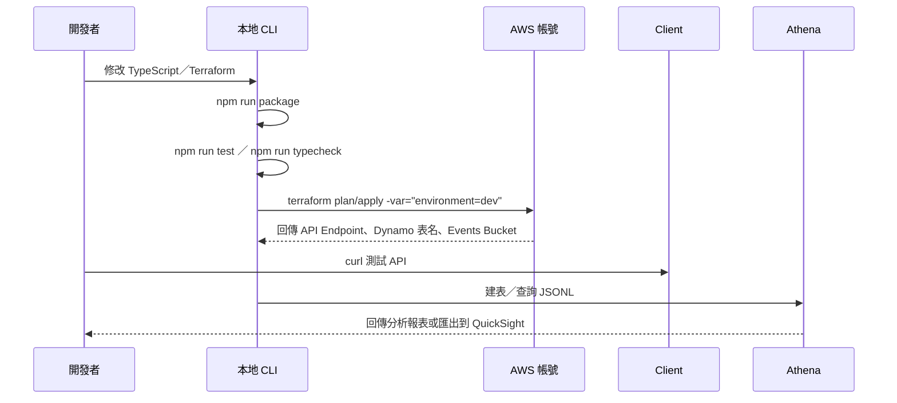

# Chainy 系統架構概覽

Chainy 是一個以 AWS Serverless 為基礎的短網址服務腳手架，適合用於雲端實戰、證照練習與資料分析實驗。本文件提供技術主管、開發者與招募者快速理解整體佈局與資料蒐集策略。

## 高階架構圖

```２２
flowchart LR
  subgraph Client
    User[使用者（瀏覽器／行動裝置）]
  end

  subgraph AWS
    APIGW[API Gateway HTTP API]
    RedirectLambda[Lambda：redirect]
    CRUDLambda[Lambda：link CRUD]
    DynamoDB[(DynamoDB：chainy_links)]
    EventsBucket[(S3：chainy-events-<env>)]
    CloudWatch[CloudWatch Logs]
  end

  User -->|HTTP GET /{code}| APIGW
  User -->|HTTP POST/PUT/GET/DELETE /links| APIGW

  APIGW -->|Invoke| RedirectLambda
  APIGW -->|Invoke| CRUDLambda

  RedirectLambda -->|Get/Update| DynamoDB
  CRUDLambda -->|Put/Get/Update/Delete| DynamoDB

  RedirectLambda -->|Async JSONL PutObject| EventsBucket
  CRUDLambda -->|Async JSONL PutObject| EventsBucket

  RedirectLambda --> CloudWatch
  CRUDLambda --> CloudWatch

  subgraph Analytics
    Athena[Athena／Glue]
    QuickSight[QuickSight／BI]
  end

  EventsBucket --> Athena
  Athena --> QuickSight
```

## 資料蒐集與隱私防護

| 類別 | 範例欄位 | 防護機制 | 主要用途 |
| --- | --- | --- | --- |
| 短網址資訊 | `code`、`target`、`created_at`、`updated_at`、`clicks` | 移除 URL Query、ISO-8601 時間 | 轉址與 CRUD 行為 |
| 行為事件 | `link_click`、`link_update`、`link_delete` | 事件類型以純文字保存 | 漏斗、稽核 |
| 使用者識別 | `owner_hash` | SHA-256（可加入鹽值），無法逆推 | 忠誠度、分群分析 |
| 錢包／鏈上資料 | `wallet_address_masked`、`wallet_provider`、`wallet_type`、`wallet_signature_present`、`chain_id`、`token_symbol/address`、`transaction_value(_usd)` | 錢包遮罩、欄位正規化 | DeFi／NFT 行為洞察、合作夥伴報表 |
| HTTP／環境 | `ip_hash`、`geo_country/region/city`、`ip_asn`、`user_language`、`device_type`、`os_family`、`browser_family` | 雜湊＋粗粒度 | 區域成長、異常偵測 |
| 行銷歸因 | `utm_*`、`tags`、`feature_flags`、`integration_partner`、`project`、`developer_id` | 字串正規化、陣列截斷 | ROI、多人共用環境報表 |

- 所有敏感欄位都先遮罩或雜湊，事件會附上 `sensitive_redacted = true` 便於後續流程判斷。
- `CHAINY_HASH_SALT`／`CHAINY_IP_HASH_SALT` 可自訂鹽值，避免 rainbow table 攻擊。

## 佈署流程



## 核心元件

- **API Gateway (HTTP API)**：提供 REST 介面，可進一步掛載 IAM/Cognito 授權。
- **Lambda**：`redirect` 與 `create` 兩個函式處理轉址與 CRUD；採 Node.js 20 + TypeScript。
- **DynamoDB**：儲存短碼文件，啟用 On-Demand + PITR。
- **S3 事件 Bucket**：以 `{event_type}/dt=YYYY-MM-DD/hour=HH` 方式存 JSONL，方便 Athena/Glue 掃描。
- **分析層**：Athena／Glue 建外部表，QuickSight 或其他 BI 工具可直接讀取。
- **觀察性**：CloudWatch Logs、後續可補 Alarm、X-Ray、Latency 指標。
- **安全預設**：IAM 最小權限、S3 SSE + Public Block、PII 雜湊遮罩。

## 建議後續強化

1. **Data Governance**：建立 Schema Registry、版本化（Glue Data Catalog、JSON Schema）。
2. **Observability**：整合 CloudWatch Metrics/Alarm、X-Ray Tracing。
3. **CI/CD**：GitHub Actions + OIDC，納入自動化 terratest／lint。
4. **資料優化**：Glue ETL 轉 Parquet，降低 Athena 掃描成本。
5. **權限控管**：依專案環境區分 S3 Bucket Policy、KMS Key，支援多租戶。
6. **產品功能**：短碼到期、速率限制、Token-based CRUD Auth、計費通知等。

歡迎依需求調整或翻譯成其他語言。
