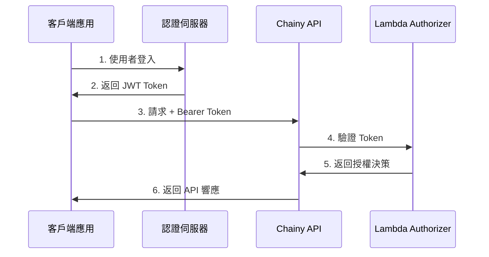

# JWT 認證整合指南

本文檔說明如何在您的應用程式中整合 Chainy API 的 JWT 認證功能。

## 📋 目錄

1. [認證流程概述](#認證流程概述)
2. [獲取 JWT Token](#獲取-jwt-token)
3. [API 呼叫範例](#api-呼叫範例)
4. [前端整合](#前端整合)
5. [錯誤處理](#錯誤處理)
6. [安全最佳實踐](#安全最佳實踐)

## 認證流程概述



## 獲取 JWT Token

### 1. JWT Token 結構

JWT Token 應包含以下聲明（claims）：

```json
{
  "sub": "user123", // 用戶 ID（必須）
  "email": "user@example.com", // 用戶 email（可選）
  "name": "用戶名稱", // 用戶名稱（可選）
  "role": "user", // 用戶角色（可選）
  "iat": 1635724800, // 發行時間
  "exp": 1635811200 // 過期時間
}
```

### 2. 生成 JWT Token

您需要實作自己的認證伺服器來發放 JWT token。以下是 Node.js 範例：

```javascript
const jwt = require("jsonwebtoken");

// 從 SSM Parameter Store 獲取密鑰（生產環境）
// 或使用環境變數（開發環境）
const JWT_SECRET = process.env.JWT_SECRET;

function generateToken(user) {
  const payload = {
    sub: user.id,
    email: user.email,
    name: user.name,
    role: user.role || "user",
  };

  return jwt.sign(payload, JWT_SECRET, {
    algorithm: "HS256",
    expiresIn: "24h", // Token 有效期 24 小時
  });
}

// 登入端點範例
app.post("/auth/login", async (req, res) => {
  const { email, password } = req.body;

  // 驗證用戶憑證
  const user = await authenticateUser(email, password);

  if (!user) {
    return res.status(401).json({ message: "Invalid credentials" });
  }

  const token = generateToken(user);

  res.json({
    token,
    user: {
      id: user.id,
      email: user.email,
      name: user.name,
    },
  });
});
```

### 3. JWT 密鑰管理

JWT 密鑰已儲存在 AWS SSM Parameter Store：

```bash
# 查看密鑰參數名稱
terraform output jwt_secret_parameter_name

# 獲取密鑰（需要 AWS CLI 和適當權限）
aws ssm get-parameter \
  --name "/chainy/prod/jwt-secret" \
  --with-decryption \
  --query "Parameter.Value" \
  --output text
```

**⚠️ 安全提醒：**

- 永遠不要在代碼中硬編碼密鑰
- 使用 SSM Parameter Store 或環境變數
- 定期輪換密鑰

## API 呼叫範例

### 1. JavaScript/TypeScript

```javascript
const API_URL =
  "https://your-api-endpoint.execute-api.ap-northeast-1.amazonaws.com";
const JWT_TOKEN = "your-jwt-token-here";

// 創建短網址
async function createShortLink(code, targetUrl) {
  const response = await fetch(`${API_URL}/links`, {
    method: "POST",
    headers: {
      Authorization: `Bearer ${JWT_TOKEN}`,
      "Content-Type": "application/json",
    },
    body: JSON.stringify({
      code,
      target: targetUrl,
    }),
  });

  if (response.status === 401) {
    throw new Error("Unauthorized: Invalid or expired token");
  }

  if (!response.ok) {
    const error = await response.json();
    throw new Error(error.message);
  }

  return await response.json();
}

// 獲取短網址資訊
async function getShortLink(code) {
  const response = await fetch(`${API_URL}/links/${code}`, {
    headers: {
      Authorization: `Bearer ${JWT_TOKEN}`,
    },
  });

  if (response.status === 401) {
    throw new Error("Unauthorized: Invalid or expired token");
  }

  if (!response.ok) {
    const error = await response.json();
    throw new Error(error.message);
  }

  return await response.json();
}

// 更新短網址
async function updateShortLink(code, newTargetUrl) {
  const response = await fetch(`${API_URL}/links/${code}`, {
    method: "PUT",
    headers: {
      Authorization: `Bearer ${JWT_TOKEN}`,
      "Content-Type": "application/json",
    },
    body: JSON.stringify({
      target: newTargetUrl,
    }),
  });

  if (response.status === 401) {
    throw new Error("Unauthorized: Invalid or expired token");
  }

  if (!response.ok) {
    const error = await response.json();
    throw new Error(error.message);
  }

  return await response.json();
}

// 刪除短網址
async function deleteShortLink(code) {
  const response = await fetch(`${API_URL}/links/${code}`, {
    method: "DELETE",
    headers: {
      Authorization: `Bearer ${JWT_TOKEN}`,
    },
  });

  if (response.status === 401) {
    throw new Error("Unauthorized: Invalid or expired token");
  }

  if (!response.ok) {
    const error = await response.json();
    throw new Error(error.message);
  }

  return { success: true };
}
```

### 2. Python

```python
import requests
import json

API_URL = "https://your-api-endpoint.execute-api.ap-northeast-1.amazonaws.com"
JWT_TOKEN = "your-jwt-token-here"

def create_short_link(code, target_url):
    headers = {
        "Authorization": f"Bearer {JWT_TOKEN}",
        "Content-Type": "application/json"
    }

    data = {
        "code": code,
        "target": target_url
    }

    response = requests.post(
        f"{API_URL}/links",
        headers=headers,
        json=data
    )

    if response.status_code == 401:
        raise Exception("Unauthorized: Invalid or expired token")

    response.raise_for_status()
    return response.json()

def get_short_link(code):
    headers = {
        "Authorization": f"Bearer {JWT_TOKEN}"
    }

    response = requests.get(
        f"{API_URL}/links/{code}",
        headers=headers
    )

    if response.status_code == 401:
        raise Exception("Unauthorized: Invalid or expired token")

    response.raise_for_status()
    return response.json()
```

### 3. cURL

```bash
# 創建短網址
curl -X POST "https://your-api-endpoint.execute-api.ap-northeast-1.amazonaws.com/links" \
  -H "Authorization: Bearer YOUR_JWT_TOKEN" \
  -H "Content-Type: application/json" \
  -d '{
    "code": "mylink",
    "target": "https://example.com"
  }'

# 獲取短網址資訊
curl "https://your-api-endpoint.execute-api.ap-northeast-1.amazonaws.com/links/mylink" \
  -H "Authorization: Bearer YOUR_JWT_TOKEN"

# 更新短網址
curl -X PUT "https://your-api-endpoint.execute-api.ap-northeast-1.amazonaws.com/links/mylink" \
  -H "Authorization: Bearer YOUR_JWT_TOKEN" \
  -H "Content-Type: application/json" \
  -d '{
    "target": "https://new-url.com"
  }'

# 刪除短網址
curl -X DELETE "https://your-api-endpoint.execute-api.ap-northeast-1.amazonaws.com/links/mylink" \
  -H "Authorization: Bearer YOUR_JWT_TOKEN"
```

## 前端整合

### React 範例

前端整合工具已包含在 `chainy-web/src/utils/auth.js` 中。

#### 1. 基本使用

```javascript
import {
  login,
  logout,
  isAuthenticated,
  getCurrentUser,
  createShortLinkWithAuth,
} from "./utils/auth";

function App() {
  const [user, setUser] = useState(null);

  useEffect(() => {
    if (isAuthenticated()) {
      setUser(getCurrentUser());
    }
  }, []);

  const handleLogin = async (email, password) => {
    try {
      const result = await login(AUTH_SERVER_URL, email, password);
      setUser(result.user);
      console.log("Login successful:", result.user);
    } catch (error) {
      console.error("Login failed:", error);
      alert("登入失敗：" + error.message);
    }
  };

  const handleLogout = () => {
    logout();
    setUser(null);
  };

  const handleCreateLink = async (code, url) => {
    if (!isAuthenticated()) {
      alert("請先登入");
      return;
    }

    try {
      const result = await createShortLinkWithAuth(API_URL, code, url);
      console.log("Link created:", result);
      alert("短網址創建成功！");
    } catch (error) {
      console.error("Failed to create link:", error);
      alert("創建失敗：" + error.message);
    }
  };

  return (
    <div>
      {user ? (
        <>
          <p>歡迎，{user.name}</p>
          <button onClick={handleLogout}>登出</button>
        </>
      ) : (
        <LoginForm onLogin={handleLogin} />
      )}
    </div>
  );
}
```

#### 2. 使用 Context API

```javascript
import React, { createContext, useContext, useState, useEffect } from "react";
import {
  isAuthenticated,
  getCurrentUser,
  saveToken,
  clearToken,
} from "./utils/auth";

const AuthContext = createContext();

export function AuthProvider({ children }) {
  const [user, setUser] = useState(null);
  const [loading, setLoading] = useState(true);

  useEffect(() => {
    if (isAuthenticated()) {
      setUser(getCurrentUser());
    }
    setLoading(false);
  }, []);

  const login = (token) => {
    saveToken(token);
    setUser(getCurrentUser());
  };

  const logout = () => {
    clearToken();
    setUser(null);
  };

  return (
    <AuthContext.Provider value={{ user, login, logout, loading }}>
      {children}
    </AuthContext.Provider>
  );
}

export function useAuth() {
  return useContext(AuthContext);
}
```

## 錯誤處理

### 常見錯誤碼

| 狀態碼 | 錯誤類型              | 說明             | 處理建議             |
| ------ | --------------------- | ---------------- | -------------------- |
| 401    | Unauthorized          | Token 無效或過期 | 清除 token，重新登入 |
| 403    | Forbidden             | 沒有權限         | 檢查用戶角色和權限   |
| 429    | Too Many Requests     | 超過速率限制     | 實作重試機制         |
| 500    | Internal Server Error | 伺服器錯誤       | 記錄錯誤，通知用戶   |

### 錯誤處理範例

```javascript
async function apiCall(url, options) {
  try {
    const response = await fetch(url, options);

    // 處理認證錯誤
    if (response.status === 401) {
      clearToken();
      window.location.href = "/login";
      throw new Error("請重新登入");
    }

    // 處理權限錯誤
    if (response.status === 403) {
      throw new Error("您沒有權限執行此操作");
    }

    // 處理速率限制
    if (response.status === 429) {
      const retryAfter = response.headers.get("Retry-After") || 60;
      throw new Error(`請求過於頻繁，請在 ${retryAfter} 秒後重試`);
    }

    if (!response.ok) {
      const error = await response.json();
      throw new Error(error.message || "請求失敗");
    }

    return await response.json();
  } catch (error) {
    console.error("API call failed:", error);
    throw error;
  }
}
```

## 安全最佳實踐

### 1. Token 儲存

✅ **推薦：**

- 使用 `localStorage` 或 `sessionStorage` 儲存 token
- 在單頁應用（SPA）中，儲存在記憶體中

❌ **不推薦：**

- 在 Cookie 中儲存（除非設置 HttpOnly 和 Secure 標誌）
- 在 URL 中傳遞 token

### 2. Token 過期處理

```javascript
function handleTokenExpiration() {
  const token = getToken();
  if (!token) return;

  try {
    const payload = parseJwtPayload(token);
    const expirationTime = payload.exp * 1000;
    const now = Date.now();

    // Token 即將過期（剩餘 5 分鐘）
    if (expirationTime - now < 5 * 60 * 1000) {
      // 嘗試刷新 token
      refreshToken();
    }
  } catch (error) {
    console.error("Error checking token expiration:", error);
  }
}

// 定期檢查 token 過期
setInterval(handleTokenExpiration, 60 * 1000); // 每分鐘檢查一次
```

### 3. HTTPS 強制使用

確保所有 API 請求都通過 HTTPS：

```javascript
function ensureHttps(url) {
  if (!url.startsWith("https://") && process.env.NODE_ENV === "production") {
    throw new Error("API calls must use HTTPS in production");
  }
  return url;
}
```

### 4. Token 洩露預防

- 不要在控制台日誌中輸出 token
- 不要在錯誤訊息中包含 token
- 使用安全的連線（HTTPS）

```javascript
// ❌ 錯誤示範
console.log("Token:", token);

// ✅ 正確示範
console.log("Token exists:", !!token);
```

## 測試認證功能

### 1. 生成測試 Token

```javascript
const jwt = require("jsonwebtoken");

const testToken = jwt.sign(
  {
    sub: "test-user-123",
    email: "test@example.com",
    name: "Test User",
    role: "user",
  },
  "YOUR_JWT_SECRET",
  {
    algorithm: "HS256",
    expiresIn: "1h",
  }
);

console.log("Test Token:", testToken);
```

### 2. 使用 Postman 測試

1. 創建新請求
2. 設置方法為 `POST`
3. URL: `https://your-api-endpoint/links`
4. Headers:
   - `Authorization`: `Bearer YOUR_TOKEN`
   - `Content-Type`: `application/json`
5. Body (raw JSON):
   ```json
   {
     "code": "test123",
     "target": "https://example.com"
   }
   ```

## 故障排除

### Token 驗證失敗

**症狀：** 收到 401 Unauthorized 錯誤

**可能原因：**

1. Token 格式錯誤（缺少 `Bearer ` 前綴）
2. Token 已過期
3. JWT 密鑰不匹配
4. Token 簽名算法不正確

**解決方案：**

```javascript
// 檢查 token 格式
const token = getToken();
console.log(
  "Token format valid:",
  /^[A-Za-z0-9-_=]+\.[A-Za-z0-9-_=]+\.?[A-Za-z0-9-_.+/=]*$/.test(token)
);

// 檢查 token 過期
const payload = parseJwtPayload(token);
console.log("Token expired:", Date.now() > payload.exp * 1000);

// 驗證 token 結構
console.log("Token parts:", token.split(".").length === 3);
```

### CloudWatch 日誌查看

```bash
# 查看 Authorizer 日誌
aws logs tail "/aws/lambda/chainy-prod-authorizer" --follow

# 搜尋驗證錯誤
aws logs filter-log-events \
  --log-group-name "/aws/lambda/chainy-prod-authorizer" \
  --filter-pattern "Token verification failed"
```

## 相關資源

- [JWT.io](https://jwt.io/) - JWT Token 除錯工具
- [AWS Lambda Authorizer 文檔](https://docs.aws.amazon.com/apigateway/latest/developerguide/http-api-lambda-authorizer.html)
- [jsonwebtoken npm package](https://www.npmjs.com/package/jsonwebtoken)
